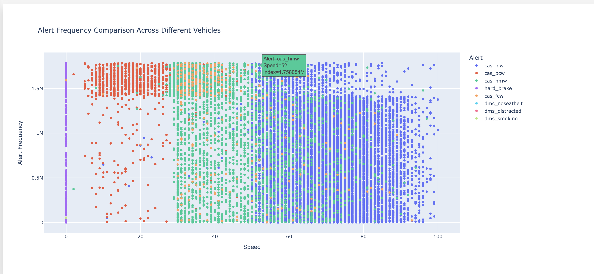

# ADAS Dataset Analysis - Wave App

This repository contains the analysis of the Advanced Driver Assistance System (ADAS) dataset, focusing on understanding the occurrence and characteristics of various alerts generated by vehicles equipped with ADAS. The analysis covers spatial distribution, alert frequency, speed analysis, correlation analysis, driver behavior analysis, and safety impact analysis.

## Dataset Description

The dataset comprises approximately 1.8 million records of ADAS alerts recorded within India. There are 8 types of alerts, including Lane Departure Warning, Headway Monitoring and Warning, Hard Brake, Pedestrian Collision Warning, Forward Collision Warning, Driver Distracted, No Seatbelt, and Smoking while Driving.

### APP Features:
- The app helps Visualizes the geographical distribution of ADAS alerts across India using a responsive, interactive map.
- The app features direct integration of interactive Plotly visualizations using HTML. This approach allows for the seamless embedding of complex, interactive plots within the H2O Wave interface, enhancing the user experience and providing rich, explorable data visualizations

### Instructions to Run the App:
- Clone the repository
- Initialize & Activate a virtual environment
- Install the requirements
- wave run app.py
- Open a web browser and navigate to `http://localhost:10101/` to view the app.