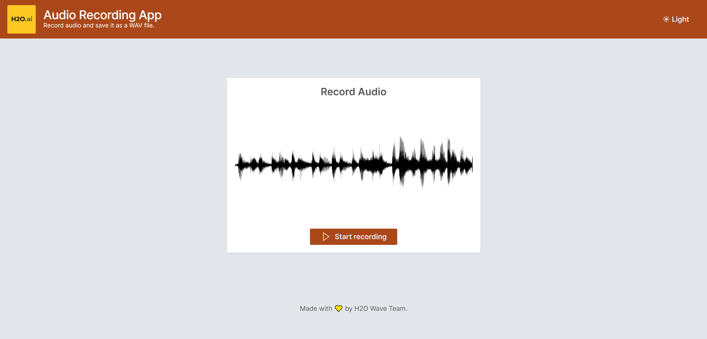
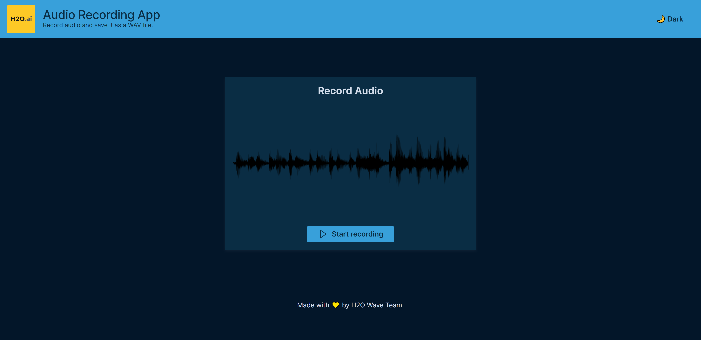

# Audio Recording Application

This application allows users to access the user’s microphone, record the audio and upload it to the Wave server for further processing

## Running this App Locally

### System Requirements
1. Python 3.7.9+
2. pip3

### 1. Run the Wave Server
New to H2O Wave? We recommend starting in the documentation to [download and run](https://wave.h2o.ai/docs/installation) the Wave Server on your local machine. Once the server is up and running you can easily use any Wave app.

### 2. Setup Your Python Environment

```bash
git clone https://github.com/h2oai/wave-apps.git
cd wave-apps/audio-recording
make setup
```

### 3. Run the App

```bash
make run
```

### 4. View the App
Point your favorite web browser to [localhost:10101](http://localhost:10101)


## Screenshots

 &nbsp;

