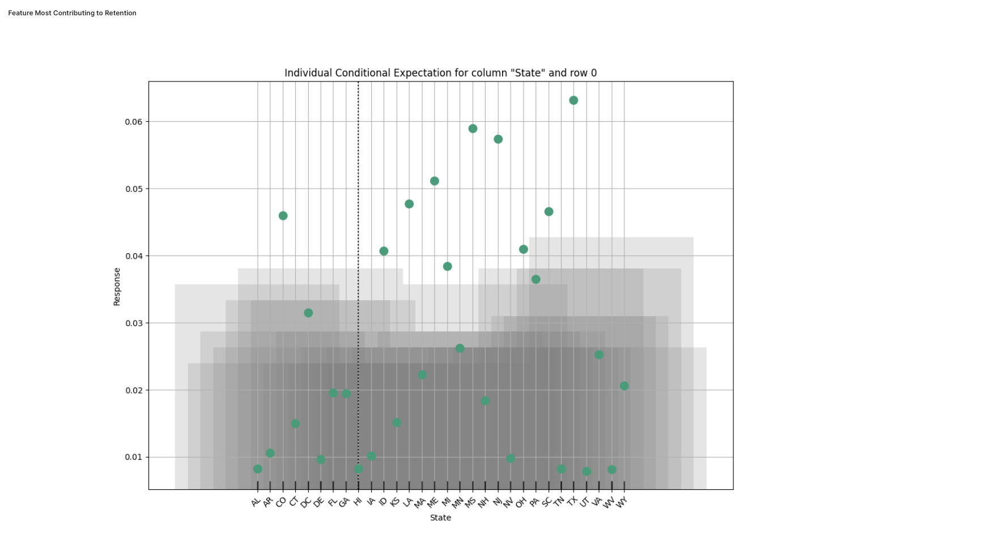

# Wave Telecom Customer Churn Application

This application allows users to explore the [Kaggle Churn Data](https://www.kaggle.com/c/churn-analytics-bda/data) 
to understand more about when and why customers are churning. 

### Screenshots from App





## Developer Guide 

### Prerequisite 
1. Python 3.8+
2. pip3
3. JRE 11+
4. NodeJS (Only needed for [Run integration tests on local machine](#run-integration-tests-on-local-machine))

### Run app on local machine 

_This has only been tested only on OSX._

1. Download a [Wave](https://github.com/h2oai/wave/releases) version higher than 0.9.0 and have that running. 
2. Create a python virtual environment in the home app directory and install requirements. 
    ```bash
    make setup
    ```
3. Activate the virtual environment.
    ```bash 
    source venv/bin/activate
    ```
4. Run the app with Wave CLI.
    ```bash
    wave run src.app
    ```
5. Point your web browser to [localhost:10101](http://localhost:10101)

After the initial setup, you can skip step 2 and 3 as the virtual environment is already available.

### Run unit tests on local machine 

1. Run unit tests.
    ```
    pytest
    ```
2. Run unit tests with coverage
    ```bash
    pytest --cov=src --cov-report html
    ```
    This will generate a html report in `htmlcov` directory.
    
### Run integration tests on local machine 

1. Go to your Wave folder downloaded in step 1 of [Run app on local machine](#run-app-on-local-machine).
2. Go to `test` folder inside Wave folder.
3. Run `npm install`
4. Go back to `churn-risk` app directory.
5. Here I assume I have Wave downloaded in my home directory. 
If you have an already running wave instance,
    ```bash
    python3 ~/wave/test/cypress.py -m src.app
    ```
   else if you want to launch a new Wave instance automatically,
   ```bash
       python3 ~/wave/test/cypress.py -m src.app -w ~/wave/waved -wd ~/wave/www
   ```

### Run unit and integration tests on Jenkins

1. Go to [Wave OSS/CI/Wave Telco Churn Risk](http://mr-0xc1:8080/job/wave-oss/job/ci/job/wave-churn-risk) pipeline 
(You should be logged into H2O.ai VPN to access Jenkins).
2. Select the branch or pull request you want to run tests on.
3. Click `Build with Parameters` button and select the desired `WAVE_REVISION`. 
Default value will work on most of the cases. 
4. At the end of the test run you can find both unit and integration test results in
pipeline artifacts and `Test Results Analyzer` tab. 
