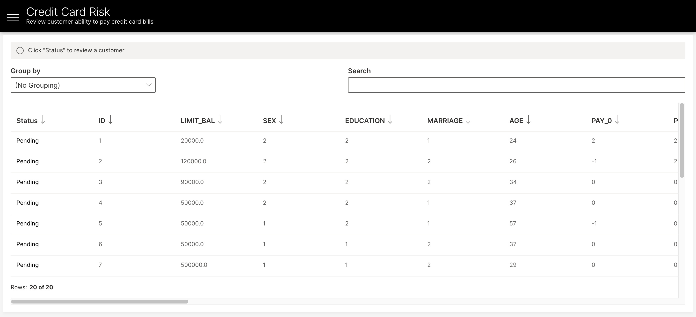
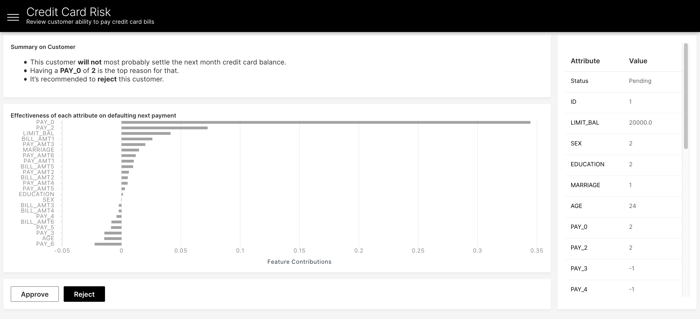
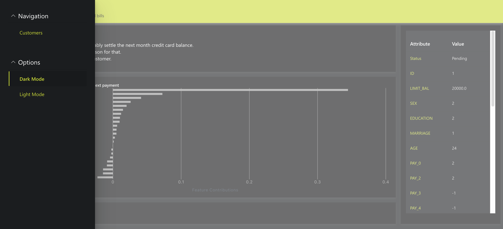

# Credit Card Risk Wave App
This application builds a model using H2O Wave ML to predict if a customer will pay off their credit card. A reviewer can then look at the prediction value and reason codes of each customer and mark the customer as approved or denied for further credit. 







## Running this App Locally

### System Requirements 
1. Python 3.6+
2. pip3
3. JRE 11+ (needed to run H2O-3) 

### 1. Run the Wave Server
New to H2O Wave? We recommend starting in the documentation to [download and run](https://wave.h2o.ai/docs/installation) the Wave Server on your local machine. Once the server is up and running you can easily use any Wave app. 

### 2. Setup Your Python Environment

```bash
$ git clone git@github.com:h2oai/wave-apps.git
$ cd wave-apps/credit-risk
$ make setup
$ source venv/bin/activate
```

### 3. Run the App

```bash
wave run src.app
```

Note! If you did not activate your virtual environment this will be:
```bash
./venv/bin/wave run src.app
```

### 4. View the App
Point your favorite web browser to [localhost:10101](http://localhost:10101)
