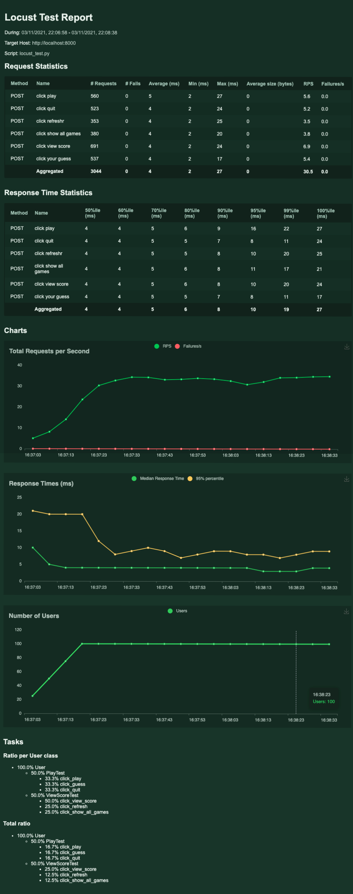

# Guess The Number

A simple game to learn [User Authentication][wave-single-sign-on], and the difference between [`q.app`, `q.user`, and `q.client`][wave-app-state] in a Wave app.

This app is a single player game where the player guesses the number picked by the
computer. All players that are logged into the same app instance can compare their
scores against each other.

#### Table Of Contents

- [Running this App Locally](#running-this-app-locally)
    - [1. Install Wave Server](#1-download-the-latest-release-of-wave-and-have-that-running)
    - [2. Create a python environment](#2-create-a-python-environment-in-the-app-directory-and-install-requirements)
    - [3. Run the app](#3-run-the-app-by-pointing-to-the-module-directory)
- [Setup User Authentication](#setup-user-authentication)


[Top](#guess-the-number)

## Running this App Locally

#### 1. Download the latest release of Wave and have that running

- Read instructions from [Wave Documentation][wave-docs-installation]

![wave installation][wave-installation-term-gif]

[Top](#guess-the-number)

#### 2. Create a python environment in the app directory and install requirements

- Need Python `3.7.9 +`

```bash
git clone https://github.com/h2oai/wave-apps.git
cd wave-apps/guess-the-number
make setup
```

[Top](#guess-the-number)

#### 3. Run the app by pointing to the module directory

```bash
make run
```

- Point your web browser to `localhost:10101`. In the future, if you want to run this app you can skip step 2 as the environment is already set up.

[Top](#guess-the-number)

## Setup User Authentication

The previous section will help get the app up and running. However, the player is always `Default-User`. Follow the instructions at [Run `waved` with authentication during development using keycloak][auth-dev-setup-keycloak] to have the ability to login as a different user. Please DO NOT use these instructions for a production environment.

[Top](#guess-the-number)

## Load testing with Locust
### How to do perf testing with locust
- You can find sample [locust test file](test/perf/locust_test.py) here, and it contains all the test cases related to the home-app wave application.
- Locust supports to be run in two ways,
  1. **UI mode:** Here you can run load test with the locust web UI. 
     - How to run it: <br/>
      `H2O_WAVE_APP_ACCESS_KEY_ID=<key_id sets to wave app> 
       H2O_WAVE_APP_ACCESS_KEY_SECRET=<secret sets to wave app> locust -f <locust test file name>`
     - E.g. <br/>`H2O_WAVE_APP_ACCESS_KEY_ID=admin 
       H2O_WAVE_APP_ACCESS_KEY_SECRET=test123  ../../venv/bin/locust -f <locust test file name>`
  2. **Command line mode:** Which is good to use with CICD tools where you need to run test cases without human user interaction.
     - How to run it: <br/> 
     `H2O_WAVE_APP_ACCESS_KEY_ID=<key_id sets to wave app> 
       H2O_WAVE_APP_ACCESS_KEY_SECRET=<secret sets to wave app> locust --headless --users <user count> --spawn-rate <user spawn rate> -H <host:port> -f <locust file name>  --html=<html report name> --run-time <run time in seconds>`
     - E.g. <br/> `H2O_WAVE_APP_ACCESS_KEY_ID=admin 
          H2O_WAVE_APP_ACCESS_KEY_SECRET=test123 
          ../../venv/bin/locust --headless --users 100 --spawn-rate 5 -H http://localhost:8000 -f locust_test  --html=locust_report_100_users.html --run-time 200s`
  3. Refer [locust documentation](https://docs.locust.io/en/stable/writing-a-locustfile.html) for more details.
  4. Here's a sample locust test report.
  <br/>
  

[wave-installation-term-gif]: ./static/install_wave_server_term.gif
[wave-app-env-setup-term-gif]: ./static/wave_app_env_setup_term.gif
[wave-docs-installation]: https://wave.h2o.ai/docs/installation
[wave-app-state]: https://h2oai.github.io/wave/docs/state
[wave-single-sign-on]: https://h2oai.github.io/wave/docs/security#single-sign-on
[auth-dev-setup-keycloak]: ./dev_authentication_setup.md
