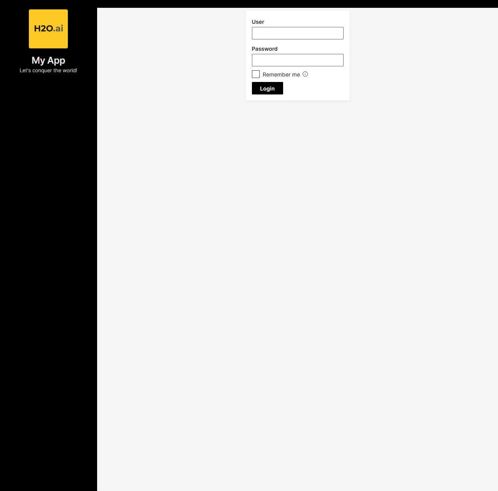
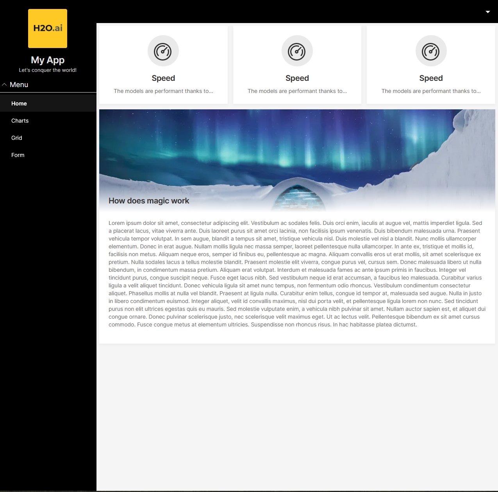

# Wave app with JWT authentication
This is an example on how to add authentication to a h2o wave app. It builds on a `wave init` example to demonstrate how non-authenticated users will not have access to the application. It also serves as a demonstration how to control and customize routing flow in a wave app.

Using OpenID Connect is a safer way to provide authentication to your users. Check the instructions for use with OpenID Connect [here](https://wave.h2o.ai/docs/security#single-sign-on) and how to set up keycloak [here](https://wave.h2o.ai/docs/development/#using-openid-connect). Keycloak via docker is a very easy way to set up your own OpenID Connect provider.

## Setup
Run `pip install -r requirements.txt` to install all dependencies.

This example uses mongodb as a database for storing the credentials (username and hashed password). I've been using the `mongodb-community-server` docker image via docker desktop (https://hub.docker.com/r/mongodb/mongodb-community-server).

## Run
Ensure that the database is running and reachable.

Use `python user_register.py` to create a new user.

Use `python user_auth.py` if you want to verify that the credentials work.

In this directory, run `wave run app`. Enter your user credentials to log in. By default, the login will stay valid for 2h (default, unless `Remember me` is selected). During this time you can open the app in multiple browser tabs without the need of logging in again. Closing the browser will not reset the token as well (unless you have settings that clear all cookies and whatnot). The session will be reset if the wave app or the wave server are restarted (e.g. if auto-reload is enabled).

To log out, open the header menu in the top-right corner and click `Logout`.

## Details
- Hides the header and the sidebar from unauthorized users
- User password is stored as hashed password
- Uses [python-jose with cryptography](https://pypi.org/project/python-jose/) for token creation and [passlib with bcrypt](https://pypi.org/project/passlib/) for password hashing
- Token is stored in user-level. While logged in, any new tab will load without need for authentication. Once logged out, already loaded pages will remain loaded but upon refresh, the user is rerouted to the login page
- The user can choose to go for a token without expiration date which lets them stay logged in until the session data is deleted.
- The JWT is stored in `q.user.secret`

## How to use in your own code
The `wave_auth.py` file contains the relevant code. Replace the example secret key with your own secret key. You can generate one with `openssl rand -hex 32`.

If you want to use a different database then mongodb, implement an interface according to the example in `mongodb_layer.py` and replace the import in `wave_auth.py`.

In `app.py`, the default `init()` and the `serve()` function were adjusted to support authentication based routing:
- Header and sidebar are still defined in `init()` but only populated after successful login. Function to fill and clear the header and sidebar are in `wave_auth.py`
- Extra zone for centered login box (`centered`)
- The auth based routing is implemented in `handle_auth_on()` which wraps the default `h2o_wave.routing.handle_on()` function. This should allow to write pages just as with regular routing.

## References
This project was bootstrapped with `wave init` -> `App with header & sidebar + navigation` command.

The JWT authentication implementation follows the [fastapi tutorial](https://fastapi.tiangolo.com/tutorial/security/oauth2-jwt/) on OAuth2 with Password and JWT Bearer tokens.
