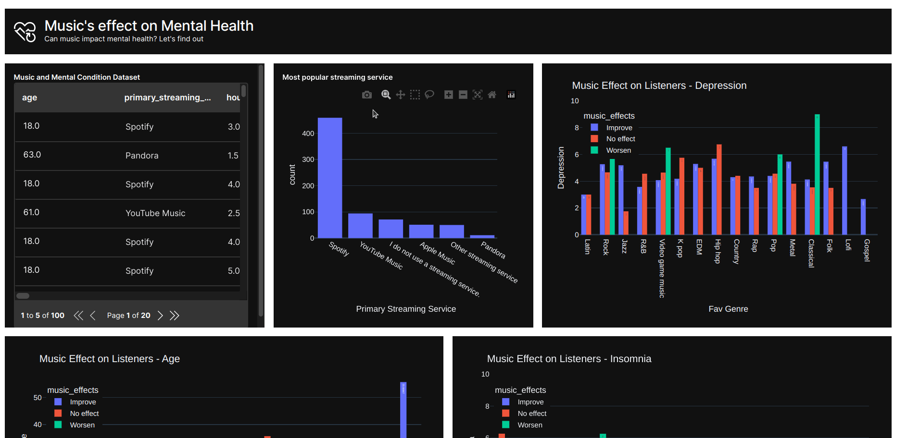

# Effect of Music on Mental Health (Community app)



Author: @Boadzie

## Introduction

> This project aims to investigate the relationship between music and mental health. We will be looking at how different types of music can affect an individual's mood and overall psychological well-being. The dataset from [Kaggle](https://www.kaggle.com/datasets/catherinerasgaitis/mxmh-survey-results)
>
> The ultimate goal is to gain a better understanding of the ways in which music can be used as a tool to promote mental health and well-being.

## Running the project (Dashboard)

To run the dashboard, do the following:

1. create a virtual environment with the command:

```bash
python -m venv .myenv
```

2. Activate the virtual environment

```bash
source .myenv/bin/activate
```

3. Install dependencies

```bash
pip install -r requirements.txt
```

4. Navigate to the `src` folder and run:

```bash
wave run src/app.py
```

5. Point your browser to `http://localhost:10101` to view the app.
