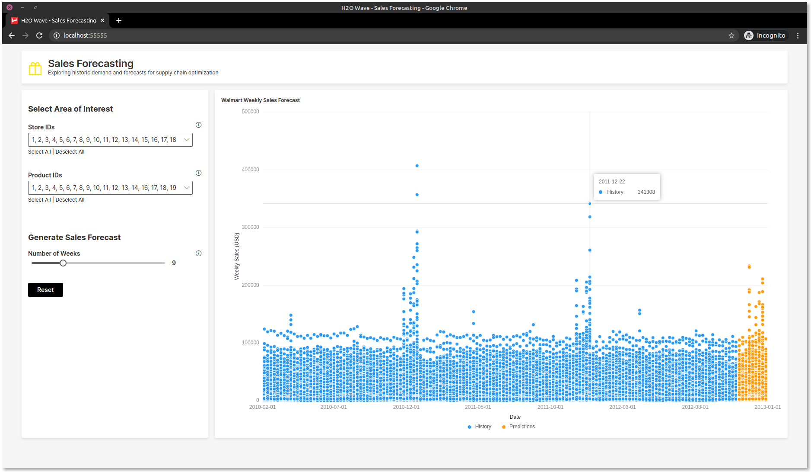

# Wave Retail Forecasting Application 

This application allows users to explore the Kaggle Walmart Sales data to understand seasonality of sales by department.
This application uses predictions made from Driverless AI but doesn't explicitly connect to a DAI instance.




## Running this App Locally

### System Requirements 
1. Python 3.6+
2. pip3
3. JRE 11+ (needed to run H2O-3) 

### 1. Run the Wave Server
New to H2O Wave? We recommend starting in the documentation to [download and run](https://h2oai.github.io/wave/docs/installation) the Wave Server on your local machine. Once the server is up and running you can easily use any Wave app. 

### 2. Setup Your Python Environment

```bash
$ git clone git@github.com:h2oai/wave-apps.git
$ cd wave-apps/credit-risk
$ make setup
$ source venv/bin/activate
```

### 3. Download input data from AWS S3

```console
$ cd wave-apps/sales-forecasting
$ s3cmd get s3://ai.h2o.benchmark/temp/walmart_train.csv .
$ s3cmd get s3://ai.h2o.benchmark/temp/walmart_test_preds.csv .
```

### 4. Run the App

```bash
wave run src.app
```

Note! If you did not activate your virtual environment this will be:
```bash
./venv/bin/wave run src.app
```

### 5. View the App
Point your favorite web browser to [localhost:10101](http://localhost:10101)
