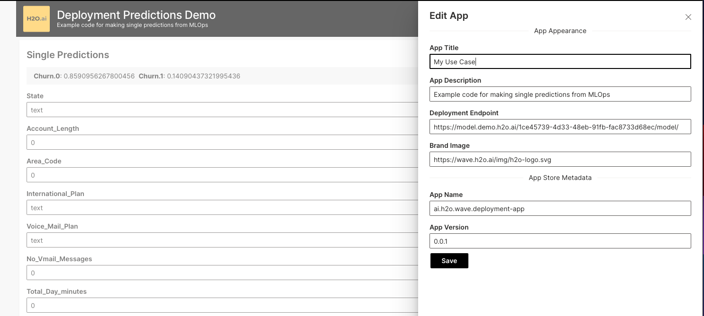
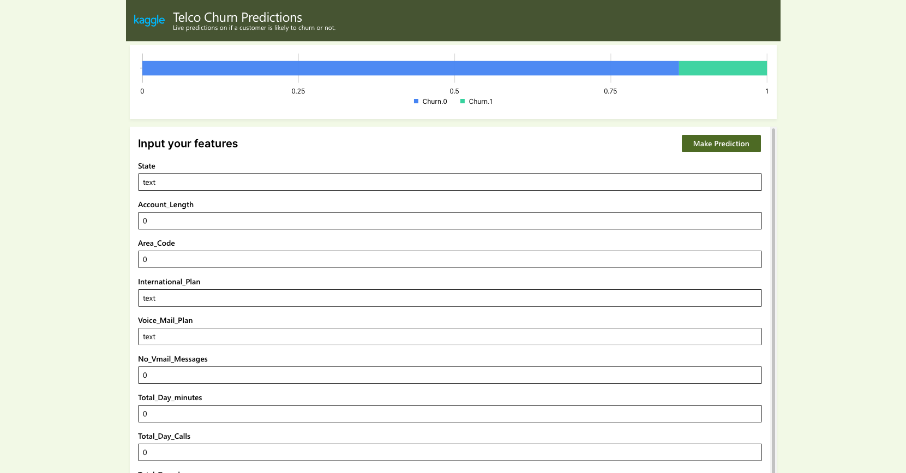

# Template: Single Predictions from H2O MLOps Deployments

This application will dynamically create a web-form to interact with an
MLOps deployment. Input your own data as features to get predictions back immediately for regression, binary, and multi-classification problems.

First, open the app and click on the upper-right corner to open the __Edit App__ menu. Then, paste the URL of the deployed MLOps model on the __Deployment Endpoint__ field and fill out the other fields accordingly.



Finally, click on the __Save__ button and a web-form for the model you've chosen will be automatically created, allowing you or other users to interact with the model and check its results in a _no-code_ manner, instantaneously.



To share the app with other users and create standalone versions of it, click again on the upper-right corner and click on __Download App Bundle__, then upload this file back to your __H2O AI Cloud__ environment to have one app created per model.

## Standalone deployments

Parameterize this app for your own use cases and deployments by updating the `app.toml` file. You
can find the source code at https://github.com/h2oai/wave-apps/tree/main/template-mlops-single-prediction

## Local Development Setup

1. Setup your local python environment
```shell script
python3 -m venv venv
./venv/bin/pip install -r requirements.txt
```

2. Run the template
We use the `H2O_WAVE_NO_LOG` parameter to only show logs from our app,
not from the app server.

```shell script
H2O_WAVE_NO_LOG=True ./venv/bin/wave run app.py
```

## HAIC Deployment
To publish this app to the H2O AI Cloud, use the [h2o CLI](https://h2oai-cloud-release.s3.amazonaws.com/releases/ai/h2o/h2o-cloud/latest/index.html).
```shell script
h2o bundle import -v ALL_USERS
```

Make sure to update the app.toml with your use case values.
