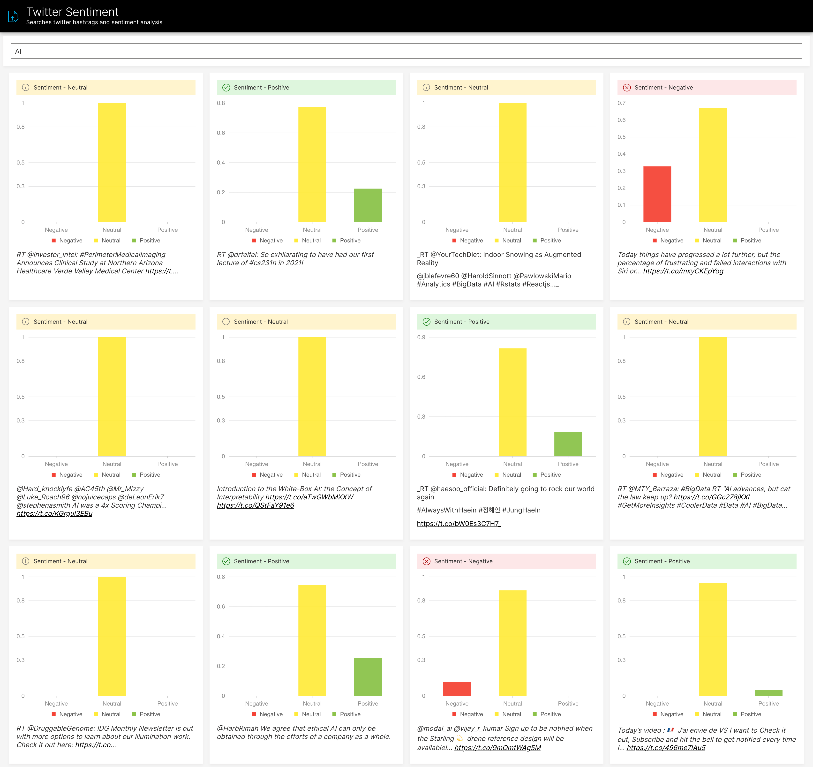

# Wave Twitter Sentiment Application

This application allows you to search for Twitter hashtags and do sentiment analysis using VaderSentiment




## Running this App Locally

### System Requirements

1. Python 3.6+
2. pip3
3. JRE 11+ (needed to run H2O-3)
4. NodeJS (Only needed for [Run integration tests on local machine](#run-integration-tests))

### 1. Run the Wave Server

New to H2O Wave? We recommend starting in the documentation to [download and run](https://h2oai.github.io/wave/docs/installation) the Wave Server on your local machine. Once the server is up and running you can easily use any Wave app.

### 2. Setup Your Python Environment

```bash
git clone git@github.com:h2oai/wave-apps.git
cd wave-apps/twitter-sentiment
make setup
source venv/bin/activate
```

### 3. Run the App

```bash
wave run src.app
```

Note! If you did not activate your virtual environment this will be:

```bash
./venv/bin/wave run src.app
```

### 4. View the App

Point your favorite web browser to [localhost:10101](http://localhost:10101)
