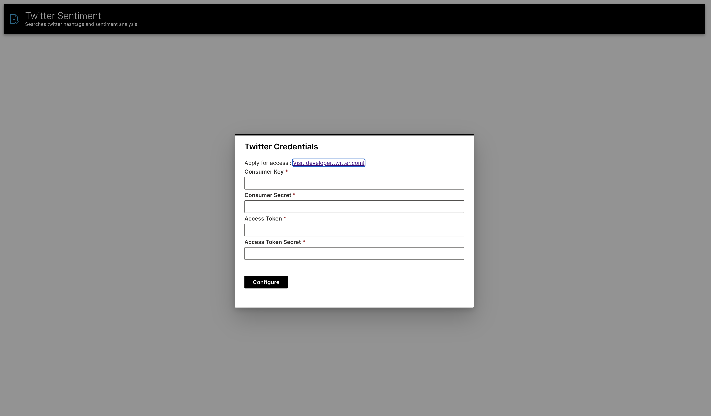
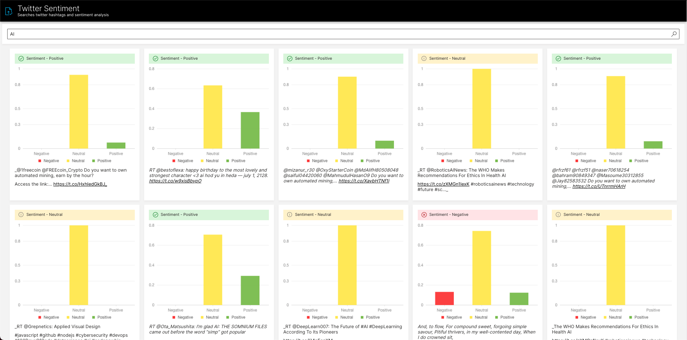

# Wave Twitter Sentiment Application

This application allows you to search for Twitter hashtags and do sentiment analysis using VaderSentiment




## Running this App Locally

### System Requirements

1. Python 3.6+
2. pip3
3. JRE 11+ (needed to run H2O-3)
4. NodeJS (Only needed for [Run integration tests on local machine](#run-integration-tests))

### 1. Run the Wave Server

New to H2O Wave? We recommend starting in the documentation to [download and run](https://wave.h2o.ai/docs/installation) the Wave Server on your local machine. Once the server is up and running you can easily use any Wave app.

### 2. Setup Your Python Environment

```bash
git clone git@github.com:h2oai/wave-apps.git
cd wave-apps/twitter-sentiment
make setup
source venv/bin/activate
```
### 3. Run the App

```bash
wave run src.app
```

Note! If you did not activate your virtual environment this will be:

```bash
./venv/bin/wave run src.app
```

### 4. View the App
Point your favorite web browser to [localhost:10101](http://localhost:10101)


## Running in the H2O AI Hybrid Cloud

This application uses an app secret for the Twitter login credentials so that it can be entered automatically upon the start of the app, avoiding manual/client login.

```
h2o secret create twitter-sentiment-secrets --from-literal=consumer_key=<CONSUMER KEY> --from-literal=consumer_secret=<CONSUMER SECRET> --from-literal=access_token=<ACCESS TOKEN> --from-literal=access_token_secret=<ACCESS TOKEN SECRET>
```